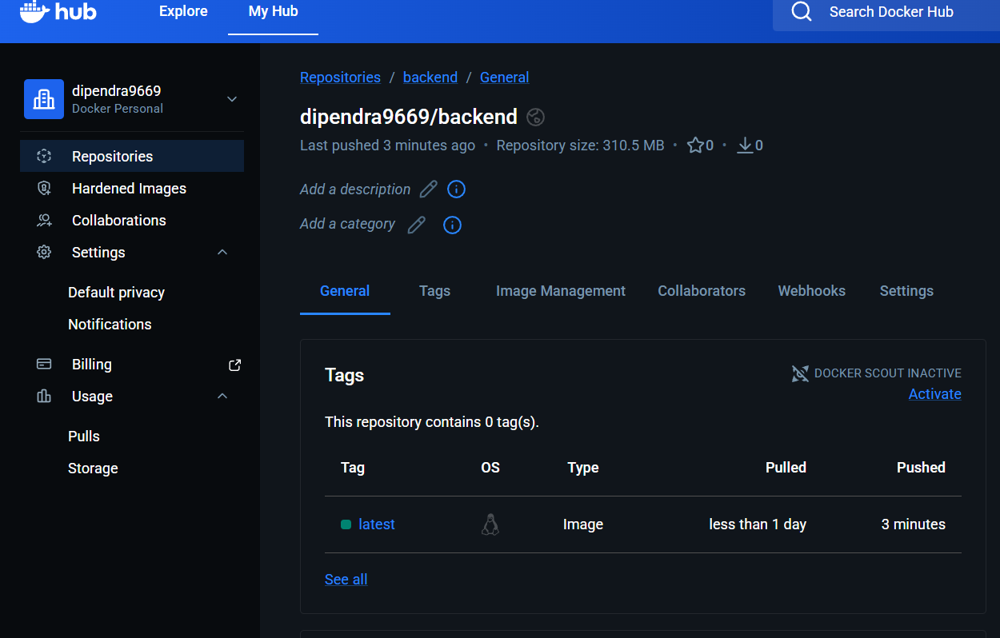
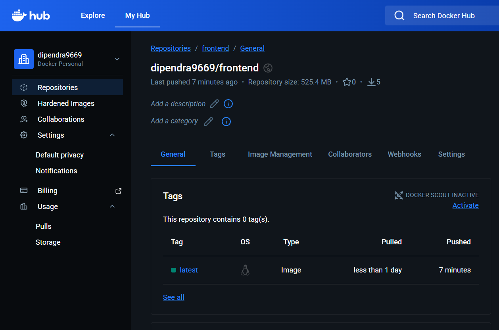
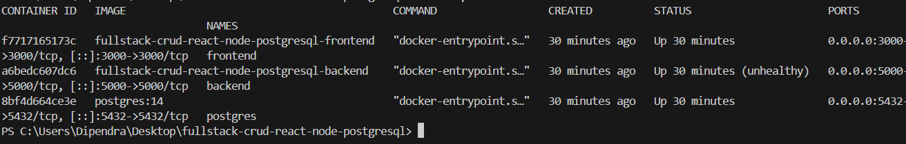
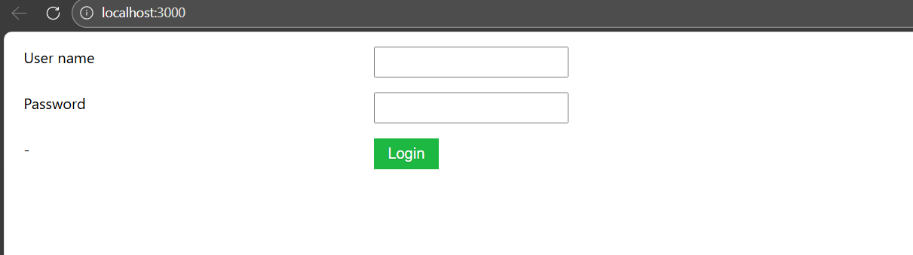

# [Dockerization of the full stack project]

Full-stack application with **Dockerized** frontend, backend, and PostgreSQL database.

Modern, containerized setup — ready to run with one command (if you have `docker compose`).

## Tech Stack

- **Frontend**: [React / Next.js / Vite + React / Vue / Angular / ...]
- **Backend**:  [Node.js + Express / NestJS / Spring Boot / FastAPI / Django / Go / ...]
- **Database**: PostgreSQL
- **Containerization**: Docker + Docker Compose (recommended)

## Features

- Completely containerized (frontend, backend, db)
- Easy local development & deployment
- Persistent PostgreSQL data (via volume)
- Frontend available at http://localhost:3000

### Docker Hub – Frontend & Backend images

### Running containers (`docker ps`)

### Frontend running at http://localhost:3000

## Prerequisites

- Docker 20+  
- Docker Compose (included in Docker Desktop / can be installed separately)